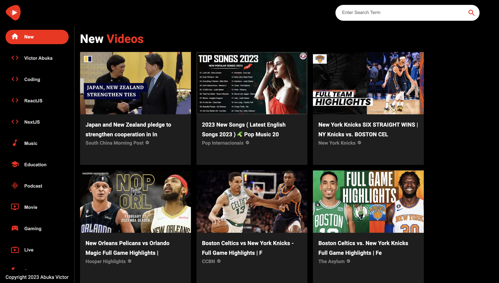

# Youtube Clone

## Overview

This is a simple implementation of a video streaming application like youtube. It does cover every feature of youtube like comments for example or recommendations but you can use it to search for videos and also watch them right from the site.

## Table of contents

- [Youtube Clone](#youtube-clone)
  - [Overview](#overview)
  - [Table of contents](#table-of-contents)
    - [Screenshot](#screenshot)
    - [Links](#links)
  - [My process](#my-process)
    - [Built with](#built-with)
    - [What I learned](#what-i-learned)
    - [Useful resources](#useful-resources)
  - [Author](#author)

### Screenshot

### Links

- Live Site URL: [Click here to check out the live site](https://qrcompfm.netlify.app/)

## My process

I started out with the Feed on the home page of the site so I can get most of the reusable components like the video card and channel card out of the way. Then I moved on the implement the search feature and finally the video detail with React Player and the channel detail. I created a util folder from which I called my APIs provided by the Youtube V3 api on Rapid API

### Built with

- React JS
- Material UI
- Rapid API
- Desktop-first workflow

### What I learned

I learned how to work with Material UI in this project. I particularly like how it doesn't clog up the markup like Tailwind. Tailwind is still my best but MUI is a strong contender for second place for me. I also found that vscode doesn't really have support for optional chaining as regards color coding. I am challenged to make a pull request that fixes that.

### Useful resources

- [JavaScript Mastery Youtube Channel](https://www.youtube.com/@javascriptmastery)
- [Material UI Docs](https://mui.com/material-ui/getting-started/overview/)
- [Rapid API](https://rapidapi.com)

## Author

- Website - [Victor Abuka](https://www.victorabuka.netlify.app)
- Twitter - [@abukaofficial](https://www.twitter.com/abukaofficial)
